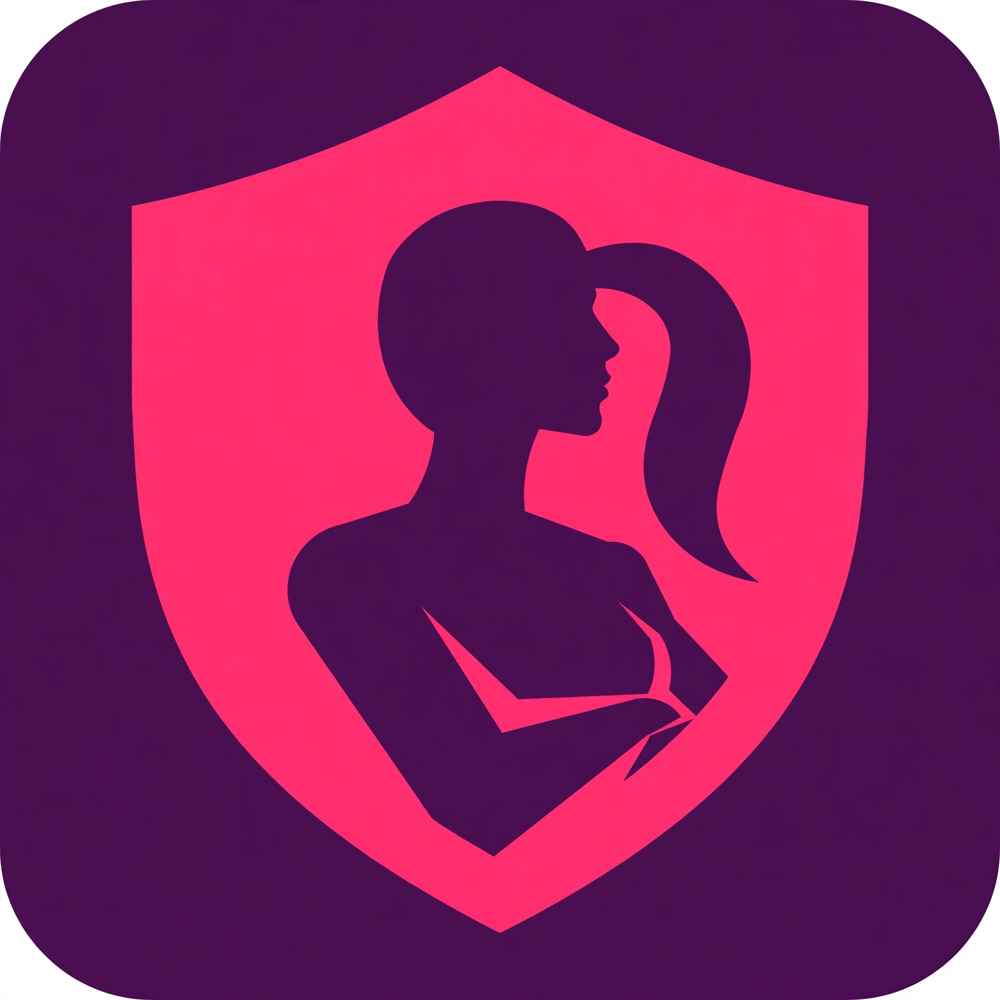

# 🛡️ Feminist-Guard 🛡️

### Strong. Safe. Protected.

**Protect Women. Empower Communities. A Safer South Africa.**

Feminist-Guard is a women's safety mobile app built for South Africa. Not a weak demo — a REAL protection app with STRONG design!

> 🎨 Design: Deep Purple #4A0E4E + Hot Pink #FF2D78 + Woman Shield Logo = POWER & STRENGTH

## 🔥 Features
- 🚨 EMERGENCY SOS — Hold 3 sec, alerts trusted contacts + live location + calls 10111
- 📍 Live Location Sharing
- 👥 Trusted Contacts (5 guardians)
- 🗺️ Safe Zones — Police & hospitals nearby
- 📞 One-Tap Emergency Call
- 🔕 Silent Alert — No sound mode

## 💪 Why STRONG?
Because safety is not soft. Safety is POWER. This app shows a woman's strength with a shield — protection + empowerment.

Built by Maranela — For women, by women.

---
⭐ Star this repo if you support women's safety!
